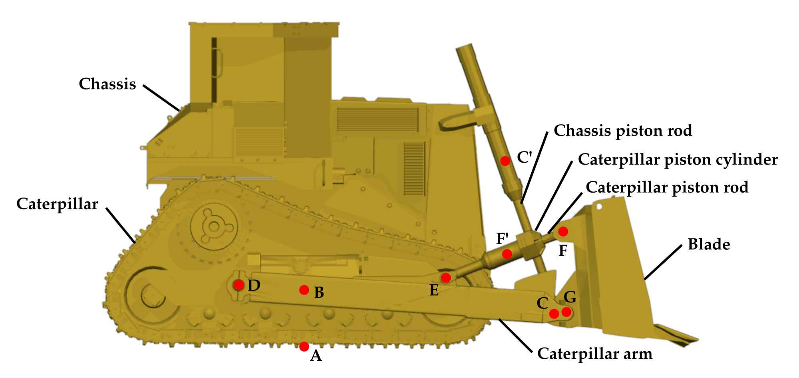
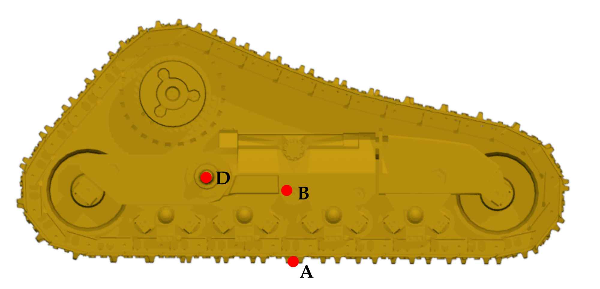
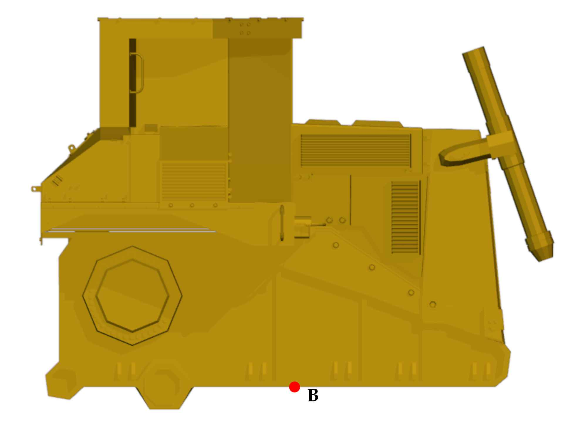
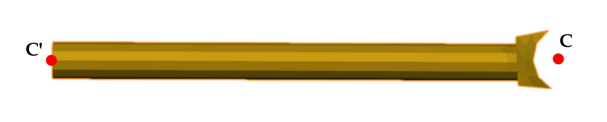
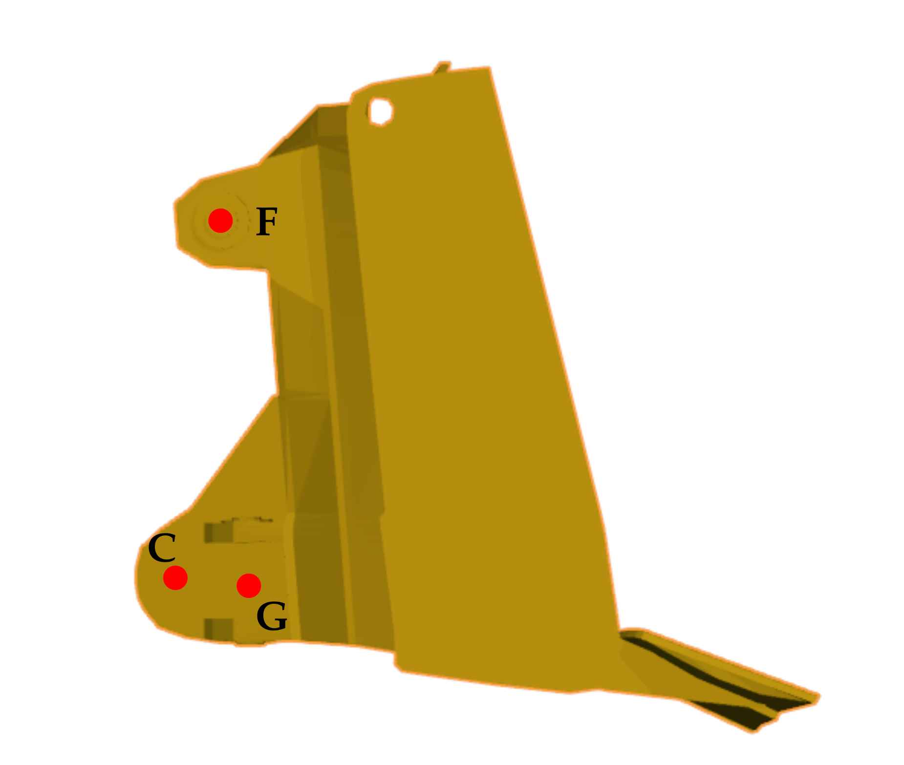
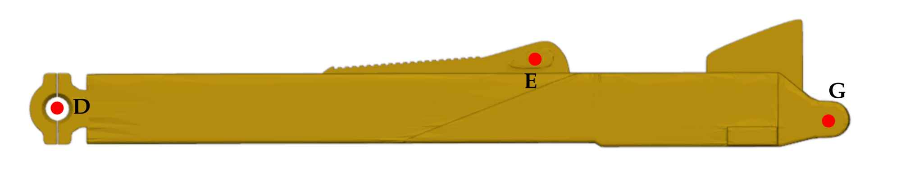
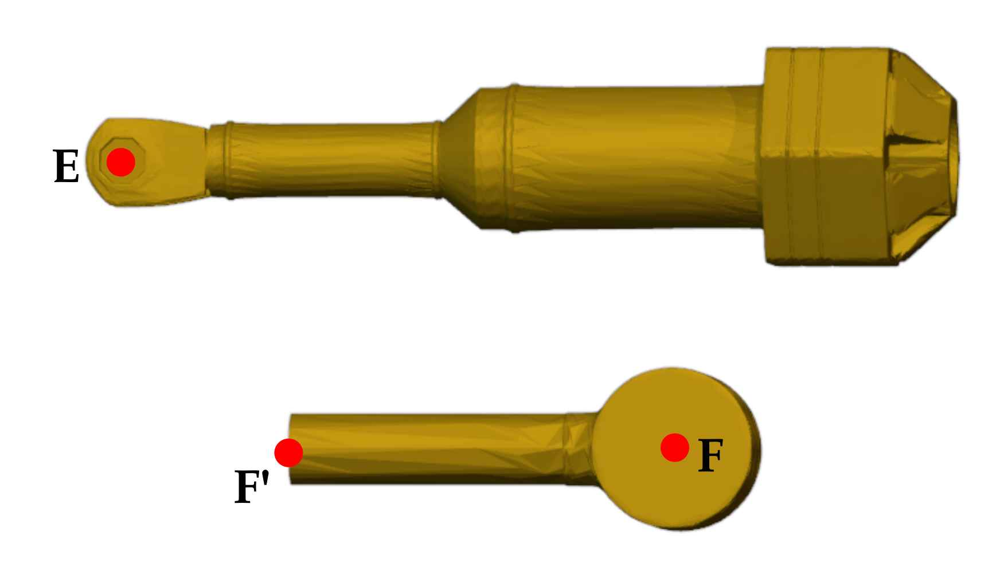

# Bulldozer model
This folder contains the bulldozer model used in this simulator.
Below is a description of the model including references for all the material used.

## Content
The bulldozer model is inside the [bulldozer.xml](bulldozer.xml) file.
The 3D model of the bulldozer has been downloaded online[^1] and modified to fit the purpose of this simulator, as described in the next section.
The meshes are stored in the `mesh` folder.

Textures have been downloaded online ([metal][metal], [steel][steel], and [dirt][dirt]) and applied to meshes using [Blender][Blender].
The resulting textures are stored in the `texture` folder.

## Model modifications
This section lists all the modifications that have been made to the original meshes.

First, unnecessary parts, such as pipes, have been removed to produce a simpler and cleaner model.
The bulldozer has then been separated into its different moving parts and scaled down (100 times).

Each part has been translated such that the origin of the mesh corresponds to the location of the joint connecting it to its parent body.
The parts are then rotated so that their reference position align with the convention described in the next section.

Last, some meshes have been remeshed using [Blender][Blender] to make the texture looks more natural.

## Model geometry
The reference frame of the bulldozer models follows the right-hand rule and assumes that the Z axis points upward.
The different parts of the bulldozer are shown below.
\
\
\

\
\
\
The names of the different parts given in this schematic follows the selected convention and would be used throughout this simulator.
Moreover, the joints connecting all the parts are also named and would be used to make the description easier.
In the following, the geometry of each part would be described.

### Caterpillar
\

\
\
\
The caterpillar is the base of the model and its origin is assumed to be at **A**.
It is connected to the chassis at **B** with a fixed joint, no movement is allowed between the caterpillar and the chassis, and to the caterpillar arm at **D** with a hinge joint in the **Y** direction.
The point **A** is set to a location that roughly corresponds to the center of the caterpillar.

Below is the Cartesian coordinates of the important points of the caterpillar in its reference position.

| Points | Coordinates       |
| ------ | ----------------- |
| **A**  | (0, 0, 0)         |
| **B**  | (0, 0, 0.722)     |
| **D**  | (-1.09, 0, 0.815) |

### Chassis
\

\
\
\
The chassis is a children of the caterpillar and its origin is assumed to be at **B**.
It is connected to the chassis piston rod at **C'** with a prismatic (slide) joint in the **X** direction.
The position of **C'** is however a function of the joint state.

Below is the Cartesian coordinates of the important points of the chassis in its reference position.

| Points | Coordinates       |
| ------ | ----------------- |
| **B**  | (0, 0, 0)         |

### Chassis/Blade hydraulic piston
\

\
\
\
The chassis hydraulic piston is composed of two parts, the chassis piston cylinder and the chassis piston rod, that connects the chassis to the blade.
However, the chassis piston cylinder is welded to the chassis so only the chassis piston rod is a separate part.

#### Chassis piston rod
The chassis piston rod is a children of the chassis and its origin is assumed to be at **C'**.
It is connected to the blade at **C** with a hinge joint in the **Y** direction.

Below is the Cartesian coordinates of the important points of the chassis piston rod in its reference position.

| Points | Coordinates   |
| ------ | ------------- |
| **C'** | (0, 0, 0)     |
| **C**  | (1.649, 0, 0) |

### Blade
\

\
\
\
The blade is a children of the chassis piston rod and its origin is assumed to be at **C**.
It is connected to the caterpillar arm at **G** with a hinge joint in the **Y** direction and to the caterpillar piston rod at **F** with a hinge joint in the **Y** direction.

Below is the Cartesian coordinates of the important points of the blade in its reference position.

| Points | Coordinates       |
| ------ | ----------------- |
| **C**  | (0, 0, 0)         |
| **F**  | (0.084, 0, 1.063) |
| **G**  | (0.16, 0, -0.015) |

### Caterpillar arm
\

\
\
\
The caterpillar arm is a children of the caterpillar and its origin is assumed to be at **D**.
It is connected to the blade at **G** with a hinge joint in the **Y** direction and to the caterpillar piston cylinder at **E** with a hinge joint in the **Y** direction.
Note that this induces a closed-loop kinematic chain.

Below is the Cartesian coordinates of the important points of the caterpillar arm in its reference position.

| Points | Coordinates       |
| ------ | ----------------- |
| **D**  | (0, 0, 0)         |
| **E**  | (2.970, 0, 0.322) |
| **G**  | (4.361, 0, 0)     |

### Caterpillar arm/Blade hydraulic piston
\

\
\
\
The caterpillar hydraulic piston is composed of two parts, the caterpillar piston cylinder and the caterpillar piston rod, that connects the caterpillar arm to the blade.

#### Caterpillar piston cylinder
The caterpillar piston cylinder is a children of the caterpillar arm and its origin is assumed to be at **E**.
It is connected to the caterpillar piston rod at **F'** with a prismatic (slide) joint in the **X** direction.
The position of **F'** is however a function of the joint state.

A possible range for the length **EF'** has been selected arbitrarily based on measurements of the mesh.

Below is the Cartesian coordinates of the important points of the caterpillar piston cylinder in its reference position.

| Points | Coordinates         |
| ------ | ------------------- |
| **E**  | (0, 0, 0)           |
| **F'** | (0.90 - 1.35, 0, 0) |

#### Caterpillar piston rod
The caterpillar piston rod is a children of the caterpillar piston cylinder and its origin is assumed to be at **F'**.
It is connected to the blade at **F** with a hinge joint in the **Y** direction.
Note that this induces a closed-loop kinematic chain.

Below is the Cartesian coordinates of the important points of the caterpillar piston rod in its reference position.

| Points | Coordinates   |
| ------ | ------------- |
| **F'** | (0, 0, 0)     |
| **F**  | (0.644, 0, 0) |

## Actuation mode

### Blade inclination
The current model uses velocity control to actuate the blade.
This is however not fully satisfactory as the blade is falling down under the influence of gravity even when a zero velocity is requested.
A custom plugin should be made to provide a better actuation.

### Blade height
Normally, the chassis piston should be able to control the blade height.
However, in the current model, this does not work properly and the blade does not move.
There are several potential reasons for this:

- In reality, the joint connecting the caterpillar arm to the blade is not a hinge joint.
  It is closer to a ball joint with some extra space to move.
  However, changing to a ball joint does not improve the situation.
- The meshes may be wrong.
  Considering the complexity of the kinematic chain, it is possible that some small offsets in joint positions totally hinders movements.

As this is not critical for this project, the vertical movement of the blade has been removed from the model.

### Locomotion
Crawler locomotion is known to be very difficult to model accurately.
One way to circumvent the modeling of the crawler itself is to decompose the crawler as a set of wheels[^2].

Here, right and left crawlers are separated into 12 wheels each that are free to move vertically within a certain range.
The vertical movement of the wheel allows the bulldozer to better absorb the terrain irregularities.
Wheels are assumed to be particularly heavy in order to avoid bouncing.
Customized friction is added such that it creates a softer contact between the wheels and the floor.

A motor actuation is then added to each set of wheels.
Right and left crawler can then be actuated separately as it is the case for the real machine.

Overall, the simulated locomotion seems to be quite different from what may be expected.
In particular, the bulldozer bounces more than it should and it may occasionally stay stuck.
Improving the locomotion would probably require parameter optimization against experimental data to measure the perfomance of the simulated bulldozer against a real machine.
This is however clearly out of the scope of this project.

## Inertia calculation
The inertia of the caterpillar, chassis and blade have been estimated with [Meshlab][Meshlab], while the inertia of other parts have been calculated assuming a cylinder shape.

As the meshes were not "watertight", they had to be modified in order to obtain an estimate with Meshlab.
The modifications made include:

- "Merge Close Vertices"
- "Trun into a Pure-Triangular mesh"
- "Uniform Mesh Resampling"
- "Close Holes"

In some cases, some vertices had to be deleted in order to obtain a watertight mesh.

Overall, the accuracy of the inertia estimate is expected to be low as it is assumed that all parts are composed of only one material (steel), and that [Meshlab][Meshlab] does not account for hollow meshes.
When rescaled with the density of steel (8000 kg/m^3), the total mass of the bulldozer was over 140t, which is much higher than the expected mass of around 70t.
As a result, a density value of 4000 kg/m^3 has been used to rescale the inertia and mass value in order to obtain a realistic total mass.

[Blender]: https://www.blender.org/
[Meshlab]: https://www.meshlab.net/
[metal]: https://www.poliigon.com/texture/lightly-worn-galvanised-steel-industrial-metal-texture/3129
[steel]: https://www.poliigon.com/texture/stainless-steel-texture-clean-brushed/7174
[dirt]: https://www.poliigon.com/texture/ground-dirt-weeds-patchy-004/6987

[^1]: by Kim Waters, https://archive3d.net/?a=download&id=0a7337eb
[^2]: https://ieeexplore.ieee.org/document/9102110
